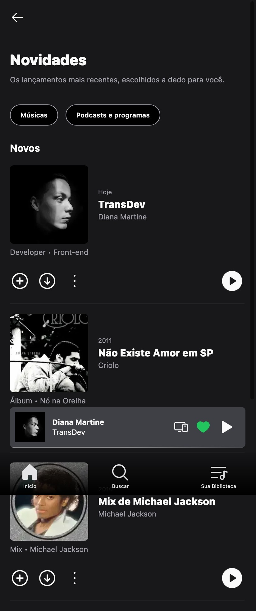
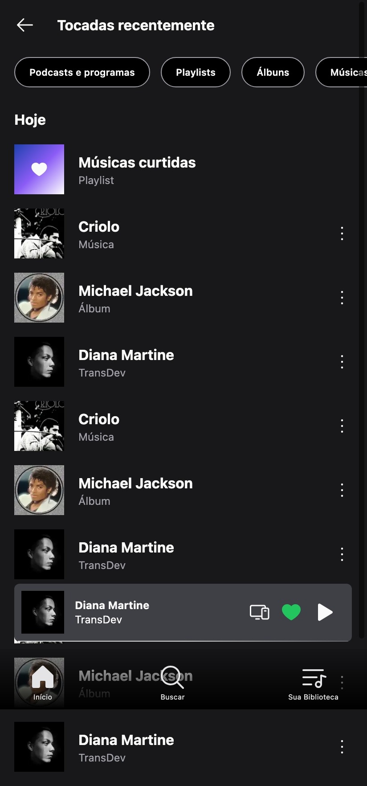
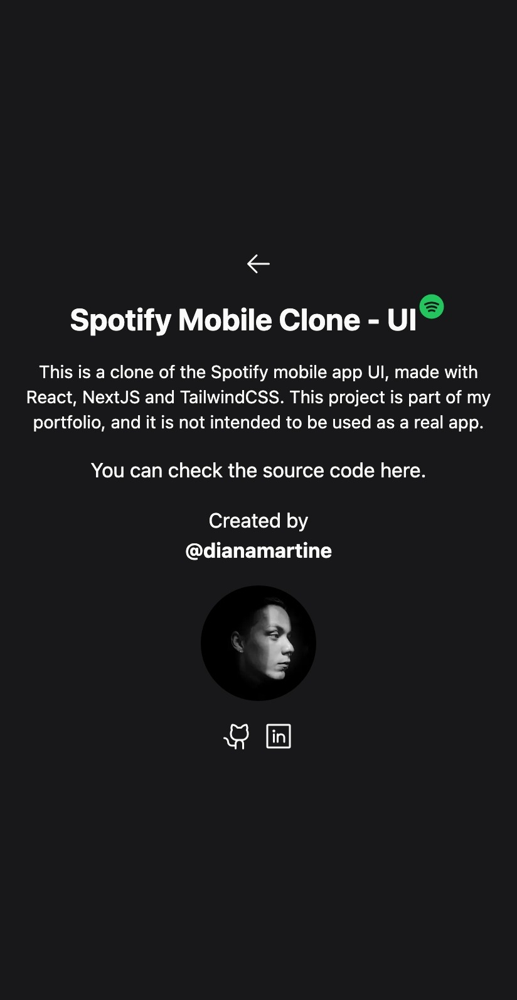

# Mobile-UIs

This project is a collection of mobile UIs that I have created using Next.js and Tailwind CSS. The viewport is set to 412px of width, which is the width of the Samsung Galaxy S20 FE (my phone). The UIs are not responsive, so they will not look good on larger screens.

## Getting Started

First, navigate to the project directory and install the dependencies:

```bash
npm install
# or
yarn install
```

Then, run the development server:

```bash
npm run dev
# or
yarn dev
```

Open [http://localhost:3000](http://localhost:3000) to view the project in the browser.

## UIs

<!-- todo: insert a valid link -->

### 1. [Spotify](https://spotify-mobile-ui-clone.vercel.app/)




